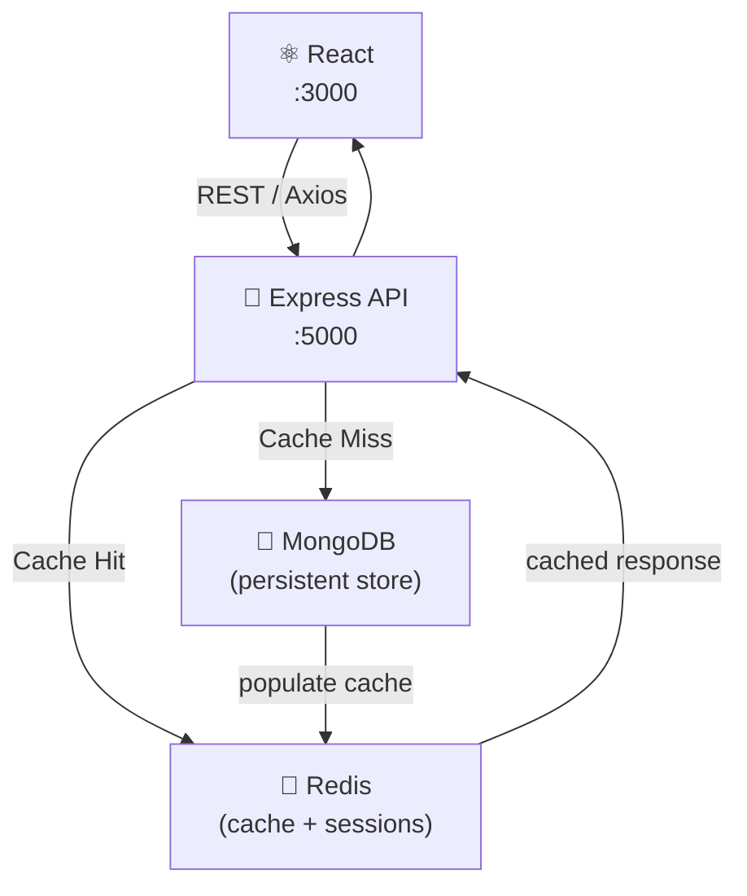

# Full-Stack MERN + Redis Example

<p align="center">
  
  
  
  
  
  
  
</p>

A production-ready **MERN stack boilerplate enhanced with Redis caching**. Demonstrates caching strategies (cache-aside, write-through), session storage, and rate-limiting with Redis — all wired with Docker Compose.

---

## 🏗️ Architecture



---

## 🚀 Quick Start

```bash
docker-compose up
```

- Frontend: http://localhost:3000
- Backend API: http://localhost:5000
- Redis Commander: http://localhost:8081

---

## ⚡ Caching Strategies

### Cache-Aside (Read)
```js
const cached = await redis.get(`user:${id}`);
if (cached) return JSON.parse(cached);

const user = await User.findById(id);
await redis.set(`user:${id}`, JSON.stringify(user), 'EX', 3600);
return user;
```

### Session Storage
```js
app.use(session({
  store: new RedisStore({ client: redis }),
  secret: process.env.SESSION_SECRET,
  resave: false,
  saveUninitialized: false,
  cookie: { secure: true, maxAge: 86400000 }
}));
```

---

## 📁 Structure

```
client/          # React + Vite frontend
server/
├── controllers/
├── models/      # Mongoose schemas
├── middleware/
│   └── cache.js # Redis cache middleware
├── routes/
└── app.js
docker-compose.yml
```

---

## 📄 License

MIT
